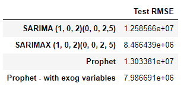

# Stock_price_prediction_using_time_series_forecasting

One of the applications of Time Series Analysis/Forecasting is to forecast the opening stock prices, closing stock prices, volume of stocks to be traded etc. In this data driven world, many firms are trying to forecast the future behaviour of the stock market. For this particular case study, we have the **stock price data of Apple** from the NASDAQ stock exchange for some time periods of 2018 through to 2019. 

We are going to divide our data into training and test, build our models on the training data, forecast for the test data time stamps and then evaluate using the Root Mean Squared Error (RMSE) model evaluation metric.

The following things are covered in this project:
1. Exploratory Data Analysis
2. ARIMA models (with and without exogenous variables)
3. Facebook’s Prophet Library

The following graph summarizes forecasts for the different time series models built.

The below table summarizes the RMSE values for the models.

As we can observe, the FB prophet model with exogeneous variables has the least RMSE value (7.986691e+06) and has a better fit compared to other models.
